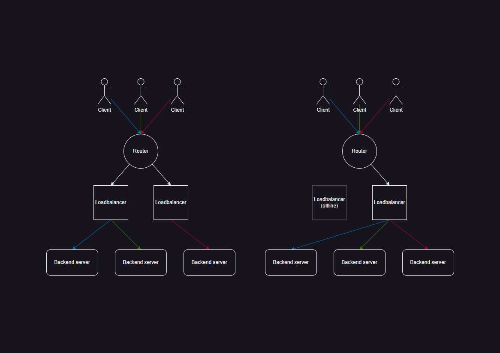
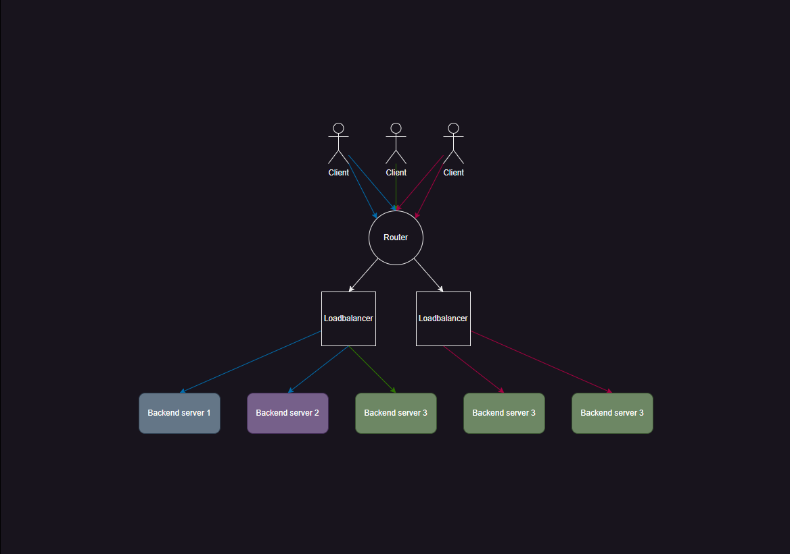

# Hashed weighted round robin
Hashed weighted round robin is a load balancing algorithm that will distribute traffic between destinations based on a hash and weight of backends.
The hash could be generated from any thing realy but I am generating it from a tcp 4 tuple. The hash is then used to select a destination from a list of backends.
The idea is that a tcp connection will always travel the same path. 

If this algorithm already exists then please let me know. I have not been able to find it.

## How it works
1. A hash is generated from some unqiue identifier. For example a tcp 4 tuple.
2. The hash is used to generate an index into a list of backends. The weight of the backend is used to determine how many times it is in the list.
3. The backend at the index is selected.

### Consitant path
Because we use a hash to select a backend the path will always be the same for the same hash. This is useful for tcp connections for example as we do not want to load balance packets from the same connection to different backends as this results in broken connections.

We can use this to our advangate when we want to use multiple load balancers in a network. These load balancers do not need to share any state as they will always select the same backend for the same hash. Because of this a router can evenly distribute packets between our load balancers and the load balancers will make sure the packets are sent to the same backend. Even when a load balancers fails the packets will still be sent to the same backend making for a very fault tolerant system.


### Weighted backends
The weight of a backend determines how many times it is in the list of backends. For example if we have 3 backends with weights 1, 1 and 3 then the list of backends will look like this.


## Results
```
goos: windows
goarch: amd64
pkg: gijs.eu/hashed-weighted-round-robin
cpu: Intel(R) Core(TM) i7-1065G7 CPU @ 1.30GHz
BenchmarkGetNextBackend-8                       427842720                2.793 ns/op
BenchmarkGetNextBackendWithSingleBackend-8      428359084                2.770 ns/op
BenchmarkGetNextBackendWithZeroWeight-8         1000000000               0.4567 ns/op
BenchmarkAllocationTestEvenWeight-8              4449729               261.4 ns/op              33.35 backend1          33.31 backend2          33.34 backend3
BenchmarkAllocationTestTopHeavyWeight-8          4535625               254.4 ns/op              60.00 backend1          20.00 backend2          20.00 backend3
PASS
ok      gijs.eu/hashed-weighted-round-robin     6.458s
```
